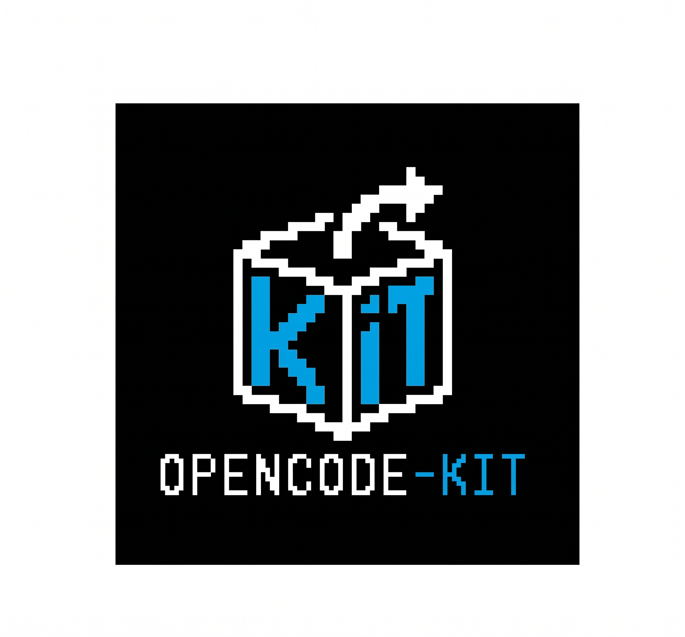

# opencode-kit



A collection of shareable OpenCode install packs and config templates.

## Language

- 中文版：[`README-zh.md`](./README-zh.md)
- English: [`README.md`](./README.md)

## What this repository is

- A shared repository of reusable OpenCode packages
- Each feature lives in its own folder under `packages/`
- Each package includes `README` and `INSTALL` docs for easy sharing and agent-assisted setup

## Included packages

- `packages/feishu-reminder/`: Feishu completion reminders
- `packages/session-name-prompt-right/`: show the current session name on the prompt right side

## Recommended usage

- Share a package by sending its `README-zh.md` or `INSTALL-zh.md`
- Ask OpenCode to install a feature using the package-specific install guide

## Layout

```text
packages/
  feishu-reminder/
  session-name-prompt-right/
```

## Extending the repo

- Add more OpenCode plugins, skills, or workflow templates under `packages/`
- Keeping the same layout makes the repo easier to maintain and share
